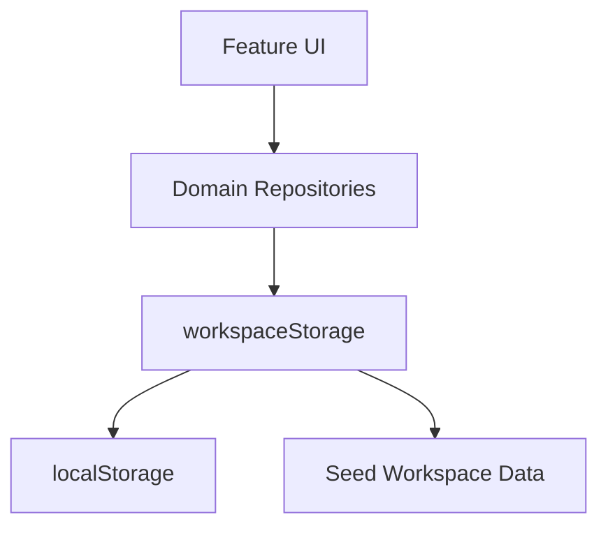

# Architecture

## Overview

Harness Studio is a local-first Next.js App Router application. The MVP uses one client-side workspace store persisted in localStorage, with repository modules separating data operations from UI components.

## Layers

- `app/`: App Router entry points for each major screen.
- `src/features/`: Product features and screen composition.
- `src/components/ui/`: Small reusable UI primitives.
- `src/lib/repositories/`: Project, project document, prompt, workflow, knowledge, asset, activity, and settings repositories.
- `src/lib/storage/`: Storage key, load/save, JSON import validation.
- `src/types/`: Domain models.
- `src/data/seed/`: Safe sample data.

## Repository Pattern

UI components never call `localStorage` directly. Repositories expose actions such as `projectRepository.create`, `promptRepository.markUsed`, and `settingsRepository.importJson`.

Project Harness-owned collections such as Next Steps, AI Team, and Rules are managed through `projectRepository`. Markdown Docs use `projectDocumentRepository` so document creation, editing, deletion, and AI-context inclusion stay behind the same data boundary.

This keeps a future Supabase migration straightforward: repository implementations can switch from localStorage to API/database calls while feature components keep the same intent-level calls.

## Client State

`HarnessApp` keeps the current workspace snapshot, active view, selected project, search modal state, and editor modal state. After every repository write, it reloads the workspace from storage.

## Import Validation

JSON import passes through `parseWorkspaceJson`. The MVP validates the top-level workspace shape and required settings identity before replacing local data.

## Accessibility

The UI uses semantic buttons and links, labeled icon buttons, visible focus states, native form fields, responsive touch targets, and keyboard search shortcuts.
